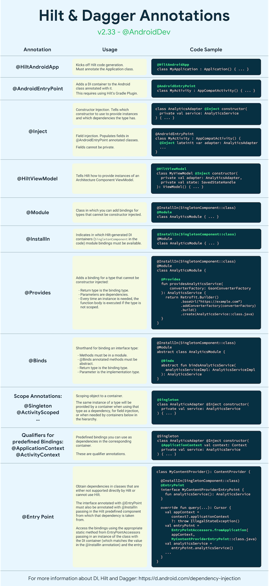

# Android Development V2

## Background Tasks

* 
* Immediate tasks => WorkManager or ForegroundServices.
* Deferred tasks => WorkManager
* Exact tasks => AlarmManager
* Runtime.getRuntime().availableProcessors()
* Ways update the ui from a non-main thread.
  * Activity.runOnUiThread(Runnable)
  * View.post(Runnable)
  * View.postDelayed(Runnable, long)
* Apps will still receive CONNECTIVITY_ACTION broadcasts if they register their BroadcastReceiver with Context.registerReceiver() and that context is still valid.

```java
// Schedule a job to run when network connectivity is resumed
Constraints constraints = new Constraints.Builder()
                    .setRequiredNetworkType(NetworkType.CONNECTED)
                    .build(); 
OneTimeWorkRequest onetimeJob = new OneTimeWorkRequest.Builder(YourJob.class)
                    .setConstraints(constraints).build(); // or PeriodicWorkRequest
WorkManager.getInstance().enqueue(onetimeJob);
```

```java
public void onClick(View v) {
    new Thread(new Runnable() {
        public void run() {
            // a potentially time-consuming task
            final Bitmap bitmap =
                    processBitMap("image.png");
            imageView.post(new Runnable() {
                public void run() {
                    imageView.setImageBitmap(bitmap);
                }
            });
        }
    }).start();
}
```

### Doze

* Standard AlarmManager alarms (including setExact() and setWindow()) are deferred to the next maintenance window.
* If you need to set alarms that fire while in Doze, use setAndAllowWhileIdle() or setExactAndAllowWhileIdle().
* Alarms set with setAlarmClock() continue to fire normally — the system exits Doze shortly before those alarms fire.
* The system doesn't perform Wi-Fi scans, and doesn't allow sync adapters a JobScheduler.

## Services

* Use services for tasks that should run even when the user is not interacting with your app. Eg. playing music in the background.
* 

## Hilt

* Application class is required and should have the @HiltAndroidApp annotation.
  * This is the parent component of the app. All other components can access the dependencies that it provides.
* Activity, Fragment, View, Service, and BroadcastReceiver can use @AndroidEntryPoint to get dependencies injected.
* Application has to use @HiltAndroidApp, and ViewModel should use @HiltViewModel for it.
* If a class is annotated as above, all of the classes that depend on it should also be annotated.


### Component Mappings

| Component                 | Injector for                      | Scope                      | Created At           | Destroyed At          | Default Bindings                       |
| ------------------------- | --------------------------------- | -------------------------- | -------------------- | --------------------- | -------------------------------------- |
| SingletonComponent        | Application                       | @Singleton                 | Application.onCreate | Application.onDestroy | Application                            |
| ActivityRetainedComponent | Application                       | @ActivityRetainedComponent | Activity.onCreate    | Activity.onDestroy    | Application                            |
| ViewModelComponent        | ViewModel                         | @ViewModelScoped           | View created         | ViewModel Destroyed   | SavedStateHandle                       |
| ActivityComponent         | Activity                          | @ActivityScoped            | Activity.onCreate    | Activity.onDestroy    | Application, Activity                  |
| FragmentComponent         | Fragment                          | @FragmentScoped            | Fragment.onAttach    | Fragment/onDestroy    | Application, Activity, Fragment        |
| ViewComponent             | View (with @WithFragmentBindings) | @ViewScoped                | View.super           | View Destroyed        | Application, Activity,. Fragment, View |
| ViewWithFragmentComponent | View                              | @ViewScoped                | View.super           | View destroyed        | Application, Activity, Fragment, View  |
| ServiceComponent          | Service                           | @ServiceScoped             | Service.onCreate     | Service.onDestroy     | Application, Service                   |

* Hilt Managed ViewModels have to be created via the ViewModelProvider API.


## Open Source Apps

* **currency**: a simple currency conversion app
* **MyExpenses**: Personal finance manager
* **admin-portal**: invoicing and payment receiving
* **moneywallet**: wallet and budgeting
* **budget-watch**: wallet and budgeting

## Reading

* [Firebase Cloud Messaging](https://firebase.google.com/docs/cloud-messaging)
* [Background Execution Limitations](https://developer.android.com/about/versions/oreo/background#services)
* [Power Limitations](https://developer.android.com/topic/performance/power/power-details)
* [Excessive wake ups](https://developer.android.com/topic/performance/vitals/wakeup)
* [Jetpack](https://developer.android.com/jetpack)

## App Monetization

https://developer.android.com/distribute/best-practices/earn/improve-conversions
https://www.youtube.com/watch?v=LQ6MsPmUa38
https://www.youtube.com/watch?v=irWymeJ9uXo
https://medium.com/googleplaydev/a-guide-to-the-google-play-console-1bdc79ca956f
https://marketingplatform.google.com/about/enterprise/
https://services.google.com/fb/forms/admobnativeadsguide/
https://admob.google.com/home/admob-advantage/
https://developers.google.com/ads
https://developers.google.com/admob/android/quick-start
https://admob.google.com/home/resources/advanced-techniques-to-optimize-in-app-revenue-with-admob/

## Resources

https://github.com/android/sunflower
https://github.com/chrisbanes/tivi
https://developer.android.com/codelabs/android-room-with-a-view#0
https://github.com/android/architecture-components-samples/tree/main/BasicRxJavaSample
